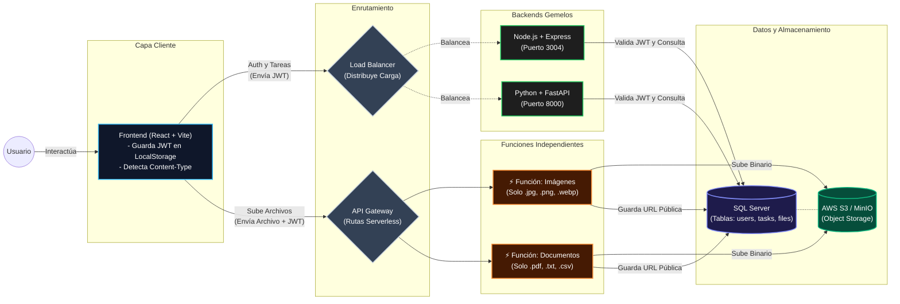

## Documento de Requerimientos y Arquitectura: TaskFlow + CloudDrive

### Contexto General

Se deberán crear **2 backends principales con exactamente la misma funcionalidad**, pero desarrollados en lenguajes diferentes: uno en **Python** y otro en **Node.js**.

Para el cliente, se utilizará un solo frontend desarrollado en React con Vite, el cual se servirá como una aplicación web estática.

### Consideraciones Técnicas Obligatorias (Para todo el equipo)

1. **Uso de SDKs de la Nube:** Para cualquier conexión desde los backends hacia los servicios de almacenamiento (como S3 o la simulación local con Minio), es obligatorio utilizar los SDKs oficiales. El equipo de Python debe usar `boto3` y el equipo de Node.js debe usar `aws-sdk` (o sus equivalentes para Azure/Minio).

2. **Autenticación y Manejo de Sesión (JWT):** Para manejar el `UID` de los usuarios de forma segura, no enviaremos el ID crudo desde el frontend. Al iniciar sesión exitosamente, el backend generará y devolverá un **Token JWT (JSON Web Token)**.
   - El frontend guardará este token y lo enviará en los _headers_ de cada petición.

   - El backend desencriptará el token para extraer el `UID` del usuario actual y saber a quién le pertenecen las tareas o archivos que se están solicitando.

### Requerimientos del Backend Principal (Node.js y Python)

#### Módulo 1: Registro de Usuarios

El endpoint de registro debe recibir y validar los siguientes datos ingresados en el formulario web:

- Nombre de usuario (debe validarse que sea único en la plataforma).

- Correo electrónico.

- Contraseña (**Obligatorio:** debe encriptarse antes de guardarse en la base de datos, por ejemplo usando `bcrypt`).

- Confirmación de la contraseña.

- Imagen de perfil.

**Notas de base de datos:** Se debe generar un identificador único (`UID`) para el usuario. Además, la imagen de perfil **no** se guarda en la base de datos; se guarda en el bucket/storage y en la tabla de usuarios solo se almacena la **URL** de dicha imagen.

#### Módulo 2: Inicio de Sesión

El endpoint de login solicitará los siguientes datos:

- Nombre de Usuario.

- Contraseña.

Al validar las credenciales, el backend devolverá el **Token JWT** mencionado en las consideraciones técnicas. Tras un login exitoso, el frontend redirigirá a la sección de tareas.

#### Módulo 3: Gestión de Tareas

Este módulo requiere una tabla en la base de datos con los siguientes campos como mínimo:

- `task_id` (Identificador único de la tarea).

- `UID` (Llave foránea para vincularla al usuario).

- Título de la tarea.

- Descripción de la tarea.

- Fecha de creación (generada automáticamente por el backend o manual).

- Estado (`completada` / `pendiente`).

**Funcionalidades:**

- **Crear:** Utilizando el `UID` extraído del token JWT, se asocia la nueva tarea al usuario.

- **Editar:** Solo se permitirá modificar el Título y la Descripción. Se requiere el `task_id`.

- **Actualizar Estado:** Cambiar el estado entre pendiente y completada.

- **Eliminar:** El usuario puede eliminar tareas en cualquier estado utilizando el `task_id`. En el frontend, las tareas completadas se sombrearán de gris, resaltando el botón de eliminar.

### Requerimientos Serverless (Separado del Backend Principal)

#### Módulo 4: Gestión de Archivos

**Importante:** La carga y obtención de archivos **NO** se hará en los backends de Node.js ni Python. Se deben construir funciones completamente independientes (Serverless).

Para cumplir con la rúbrica de calificación, se deben crear **dos funciones aisladas** (que luego se subirán a AWS Lambda y Azure Functions):

1. **Función 1 (Imágenes):** Un script exclusivo para cargar imágenes (ej. `.jpg`, `.png`, `.webp`) al bucket.

2. **Función 2 (Documentos):** Un script exclusivo para cargar archivos de texto y otros formatos generales (ej. `.txt`, `.csv`, `.pdf`).

**Instrucción crucial para el Frontend y Serverless (El `Content-Type`):**

Como en la nube todos los archivos se guardan igual, es **obligatorio** que el frontend detecte qué tipo de archivo está subiendo el usuario y envíe esa información a la función Serverless.

- Cuando la función Serverless guarde el archivo en S3/Minio, debe asignarle el `Content-Type` correcto (ej. `application/pdf` para un PDF).

- Si no hacen esto, cuando el usuario intente "Visualizar" el archivo, el navegador no sabrá qué es y forzará una descarga con errores en lugar de mostrarlo.

**Tabla de Base de Datos para Archivos:**

Se requiere una tabla para llevar el registro de lo que cada usuario ha subido, con los campos:

- `file_id` (Identificador único).

- `UID` (Del dueño del archivo).

- Nombre del archivo (necesario para la lista del frontend, ej. "reporte_usac.pdf").

- URL del archivo en el Storage.

- Tipo de archivo (ej. "PDF", "Documento de Texto", "Imagen").

- Fecha de creación.

**Funcionalidades:**

- Al entrar a la sección de archivos, el frontend enviará el token JWT, se extraerá el `UID`, y se devolverá la lista completa de archivos mostrando **nombre y tipo**

- Al seleccionar un archivo, se redirigirá a su visualización completa utilizando la URL almacenada.

### Diseño de Base de Datos (Script SQL para SQL Server)

Este script contiene la creación de las 3 tablas necesarias para cumplir con los módulos de la práctica, incluyendo las restricciones de seguridad y las relaciones entre ellas.

```sql
-- 1. Tabla de Usuarios
CREATE TABLE users (
    uid INT IDENTITY(1,1) PRIMARY KEY,
    username VARCHAR(50) UNIQUE NOT NULL,
    email VARCHAR(100) UNIQUE NOT NULL,
    password VARCHAR(255) NOT NULL,
    profile_image_url VARCHAR(500)
);

-- 2. Tabla de Tareas
CREATE TABLE tasks (
    task_id INT IDENTITY(1,1) PRIMARY KEY,
    uid INT NOT NULL,
    title VARCHAR(150) NOT NULL,
    description TEXT,
    creation_date DATETIME DEFAULT GETDATE(),
    status VARCHAR(20) DEFAULT 'pendiente' CHECK (status IN ('pendiente', 'completada')),

    FOREIGN KEY (uid) REFERENCES users(uid) ON DELETE CASCADE
);

-- 3. Tabla de Archivos
CREATE TABLE files (
    file_id INT IDENTITY(1,1) PRIMARY KEY,
    uid INT NOT NULL,
    file_name VARCHAR(255) NOT NULL,
    file_url VARCHAR(500) NOT NULL,
    file_type VARCHAR(100) NOT NULL,
    creation_date DATETIME DEFAULT GETDATE(),

    FOREIGN KEY (uid) REFERENCES users(uid) ON DELETE CASCADE
);
```

### Notas adicionales:

- **`IDENTITY(1,1)`:** No es necesario que envíen el `uid`, `task_id` o `file_id` al hacer un `INSERT` en la base de datos. SQL Server generará estos números automáticamente para garantizar que sean únicos.

- **`DEFAULT GETDATE()`:** Para los campos de `creation_date` en Tareas y Archivos, no necesitan calcular la fecha en Node.js o Python. Al hacer el insert, si omiten ese campo, la base de datos pondrá la fecha y hora exacta del servidor por sí sola.

- **El campo password (`VARCHAR(255)`):** Está configurado con longitud de 255 caracteres a propósito. Aunque la contraseña del usuario sea corta, al utilizar `bcrypt` para encriptarla se generará una cadena larga (un hash). Si el campo fuera muy corto, el hash se cortaría y el login fallaría.

- **Restricción `CHECK` en estado de Tareas:** El campo `status` solo acepta los textos `'pendiente'` o `'completada'`. Si el backend intenta insertar "Terminada" o "En proceso", la base de datos tirará un error para mantener la información limpia.

### Entorno de Desarrollo Local y Variables de Entorno

Para que todo el equipo pueda probar la aplicación en sus propias computadoras sin afectar los recursos en la nube, utilizaremos Docker Compose para levantar una base de datos SQL Server y un servidor MinIO (que simulará a AWS S3 / Azure Blob Storage).

#### 1. Infraestructura Local (`docker-compose.yml`)

En la raíz del proyecto, deben crear un archivo llamado `docker-compose.yml` con la siguiente configuración. **Importante sobre SQL Server:** A diferencia de otros motores, la imagen oficial de SQL Server no crea las tablas automáticamente al arrancar. Una vez que el contenedor esté corriendo, deberán conectarse a él usando DBeaver (con el usuario `sa` y la contraseña del `.env`), crear la base de datos y ejecutar el script SQL de arriba manualmente una sola vez.

```YAML
version: '3.8'

services:
  minio:
    image: minio/minio:RELEASE.2022-11-11T03-44-20Z
    ports:
      - "9000:9000" # Puerto para el API (El que usarán los SDKs boto3 y aws-sdk)
      - "9001:9001" # Puerto para la Consola Web
    volumes:
      - ./minio_storage:/data
    command: server /data --console-address ":9001"
    env_file: .env
    restart: always

  sqlserver_db:
    image: mcr.microsoft.com/mssql/server:2022-latest
    ports:
      - "1433:1433" # Este es el puerto estándar de SQL Server
    environment:
      ACCEPT_EULA: "Y"
      MSSQL_SA_PASSWORD: ${MSSQL_SA_PASSWORD} # Lee la contraseña del archivo .env
    volumes:
      - sqlserver_data:/var/opt/mssql
    restart: always

volumes:
  sqlserver_data:
```

#### 2. Estrategia de Variables de Entorno (`.env`)

**Regla estricta para el equipo:** NO utilizaremos un solo archivo `.env` global. Mezclar credenciales de base de datos con variables del frontend es un riesgo de seguridad grave. Cada entorno tendrá su propio archivo de configuración en su respectiva carpeta y **ninguno debe subirse al repositorio** (asegúrense de tenerlos en el `.gitignore`).

### **A. Infraestructura (Ubicación: Raíz del proyecto `/`)**

Este archivo solo lo utiliza Docker para levantar los contenedores locales.

```env
# Archivo: /.env
# INFRAESTRUCTURA LOCAL (Docker)

# Credenciales de SQL Server (¡Debe contener mayúsculas, minúsculas, números y símbolos!)
MSSQL_SA_PASSWORD=SuperPassword123!
MSSQL_DATABASE=taskflow_db

# Credenciales de MinIO
MINIO_ROOT_USER=admin_local
MINIO_ROOT_PASSWORD=password_seguro_minio
```

### **B. Backends (Ubicaciones: `/backend-node/.env` y `/backend-python/.env`)**

Ambos backends deben apuntar a la misma base de datos y al mismo storage. Comparten casi la misma configuración.

```env
# Archivo: /backend-node/.env  y  /backend-python/.env
# CONFIGURACIÓN DEL SERVIDOR

PORT=3000 # Nota: El equipo de Python debe cambiar esto a 5000 u 8000

# Base de datos (SQL Server Local)
DB_HOST=127.0.0.1
DB_PORT=1433
DB_USER=sa
DB_PASSWORD=SuperPassword123!
DB_NAME=taskflow_db

# Nube / Storage (Minio en local, S3 en AWS)
AWS_ACCESS_KEY_ID=admin_local
AWS_SECRET_ACCESS_KEY=password_seguro_minio
AWS_REGION=us-east-1
AWS_ENDPOINT_URL=http://127.0.0.1:9000
AWS_BUCKET_NAME=practica2semi1a1s2026archivosg9

# Seguridad
JWT_SECRET=una_clave_muy_secreta_y_larga_para_firmar_tokens
```

#### C. Frontend (Ubicación: `/frontend/.env`)

Vite inyectará estas variables al compilar. Es la única variable que necesita el cliente para saber a dónde enviar las peticiones.

```env
# Archivo: /frontend/.env
# CONFIGURACIÓN DEL CLIENTE

# En local apuntará al backend de Node o Python que estén probando
VITE_API_URL=http://localhost:3000

# URL del backend principal (Node/Python)
VITE_API_URL=http://practica2-lb-aws.us-east-1.elb.amazonaws.com

# URL de la Función Serverless (API Gateway / Azure API Management)
VITE_API_SERVERLESS_URL=https://abc123xyz.execute-api.us-east-1.amazonaws.com/prod/subir
```

### Conexión Frontend - Backend (Local vs. Producción)

El frontend en React/Vite es una aplicación completamente separada. Su única forma de comunicarse con la base de datos o subir archivos es a través de peticiones HTTP (fetch/axios) dirigidas a la URL definida en la variable `VITE_API_URL` de su archivo `.env`.

Para cumplir con la arquitectura exigida en la rúbrica, la conexión funcionará de dos maneras distintas dependiendo de en qué fase estemos:

#### Fase A: Desarrollo Local

Durante el desarrollo, probaremos los backends uno por uno. El frontend se conectará directamente al puerto del servidor que tengamos encendido.

- Si estás probando el código del equipo de **Node.js** (ej. corriendo en el puerto 3000), tu `.env` del frontend debe decir:

  `VITE_API_URL=http://localhost:3000`

- Si luego quieres probar el código del equipo de **Python** (ej. corriendo en el puerto 5000), simplemente cambias la variable y reinicias el frontend:

  `VITE_API_URL=http://localhost:5000`

#### Fase B: Producción (Despliegue en AWS / Azure) Requisito Clave

En la nube, el frontend **NUNCA** apuntará directamente a la IP de la instancia de Node.js ni a la de Python. Si hiciéramos eso y esa máquina se apaga, la aplicación entera se caería, perdiendo puntos en la calificación.

En su lugar, el frontend apuntará al **Balanceador de Carga (Load Balancer)**.

**¿Cómo funciona?**

1. Justo antes de compilar el frontend para producción (`npm run build`), cambiaremos el archivo `.env` para que apunte al DNS público del balanceador. Ejemplo:

   `VITE_API_URL=http://practica2-lb-aws.us-east-1.elb.amazonaws.com`

2. Subiremos los archivos estáticos generados a los buckets (S3 y Blob Storage).

3. Cuando un usuario use la página y cree una tarea, la petición llegará al Balanceador de Carga.

4. El Balanceador decidirá automáticamente a cuál de los dos servidores (Node o Python) enviarle el trabajo para distribuir la carga.

5. Si apagamos el servidor de Node.js, el Balanceador lo detectará y enviará todo el tráfico al de Python, manteniendo el sistema funcionando sin interrupciones.

## Backend_Node

### 1. Arranque y Configuración Inicial

- **Instalación:** Deben clonar el repositorio, entrar a la carpeta `backend_node` y ejecutar `npm install` para descargar Express, Bcrypt, JWT y el SDK de AWS.

- **El archivo `.env`:** Nadie debe subir su `.env` al repositorio. Cada quien debe crear uno en su máquina guiándose por el ejemplo dejado en este mismo documento

- **Ejecución:** Con el comando `npm run dev`, Nodemon levantará el servidor (por defecto en el puerto 3004) y se quedará escuchando cambios en vivo.

### 2. Estructura de Rutas y Controladores

La arquitectura está dividida para mantener el orden. El equipo no debe meter toda la lógica en el `index.js`.

- **`src/routes/`:** Aquí se definen las URLs (los endpoints). Por ahora solo existe `usuarios.routes.js`. Cuando el equipo empiece con las tareas, deberán crear un `tareas.routes.js` y conectarlo en el `index.js` usando `app.use("/api/tareas", require("./routes/tareas.routes"))`.

- **`src/controllers/`:** Aquí vive la lógica pesada (las consultas SQL y la subida de archivos). Las rutas simplemente llaman a las funciones de los controladores.

### 3. El Flujo de Autenticación (JWT)

Este es el punto más crítico para los que van a desarrollar el CRUD de Tareas.

- **El Login:** Cuando un usuario inicia sesión, el controlador valida la contraseña encriptada (Bcrypt) contra la base de datos. Si todo es correcto, el backend no devuelve un simple "OK"; devuelve un **Token JWT**.

- **Proteger Rutas Nuevas:** Para el módulo de tareas, el equipo no debe permitir que cualquiera cree o borre tareas. Tendrán que crear un "middleware" (una función intermedia) que intercepte la petición, lea el Token que envía el frontend en la cabecera HTTP, lo desencripte usando la variable `JWT_SECRET`, y extraiga el `uid` (ID del usuario).

- **La Regla de Oro:** El frontend nunca debe enviar el `uid` en el cuerpo de la petición por motivos de seguridad; el backend siempre debe extraer ese `uid` leyendo el Token JWT.

### 4. Interacción con la Base de Datos

El proyecto utiliza SQL Server, y el código está preparado para evitar vulnerabilidades.

- **Conexión:** La función `getConnection()` en `src/config/db.js` abre un pool de conexiones hacia el contenedor local de Docker.

- **Consultas Seguras:** El equipo siempre debe usar parámetros preparados (`.input('nombre', sql.VarChar, variable)`) en lugar de concatenar strings directamente en la consulta SQL. Esto evita ataques de inyección SQL.

### 5. Carga de Archivos (El puente hacia MinIO/S3)

El equipo de frontend y el que trabaje en el módulo de archivos deben entender cómo funciona el controlador de `archivos.controller.js` que acabas de configurar.

- **Límites de Peso:** El `index.js` está configurado para aceptar hasta `100mb` de carga útil. Esto permite que el frontend envíe imágenes convertidas a texto (Base64).

- **Procesamiento:** El controlador recibe el Base64, limpia automáticamente los encabezados (soportando PNG, JPEG, WEBP) y lo convierte a un buffer binario.

- **Almacenamiento:** Utiliza el SDK oficial (`@aws-sdk/client-s3`) para subir ese buffer a MinIO de forma invisible. Al terminar, le devuelve al frontend una URL pública lista para guardarse en la base de datos o mostrarse en la pantalla.

- **Nota de Arquitectura:** Debes recordarles que, aunque esta lógica está en el backend de Node por ahora para agilizar el desarrollo, la rúbrica exige que eventualmente se mueva a una función Serverless independiente.

## Backend_Python (FastAPI)

**1. Arranque y Configuración Inicial**

- **Entorno Virtual:** Deben clonar el repositorio, entrar a la carpeta `backend_python` y crear un entorno virtual para no ensuciar su sistema (`python -m venv venv`). Luego activarlo (`source venv/bin/activate` en Linux/Mac o `venv\Scripts\activate` en Windows).

- **Instalación:** Ejecutar `pip install -r requirements.txt` para descargar FastAPI, Uvicorn, Boto3, PyJWT y pymssql.

- **El archivo `.env`:** Al igual que en Node, cada quien debe crear su archivo local guiándose por el documento principal.

- **Ejecución:** Con el comando `python main.py` (estando en la raíz de `backend_python`), Uvicorn levantará el servidor y el parámetro `reload=True` hará que escuche los cambios en vivo, igual que Nodemon.

- **Bonus de FastAPI:** Si entran a `http://localhost:8000/docs`, verán una interfaz de Swagger autogenerada para probar la API sin necesidad de Postman.

**2. Estructura de Rutas y Controladores** FastAPI es muy estricto con los tipos de datos, lo que hace que el código sea muy seguro.

- **`src/routes/`:** Aquí usamos `APIRouter` de FastAPI para definir los endpoints. Además, utilizamos clases de **Pydantic** (`class RegistroData(BaseModel):`) para obligar a que el JSON que envíe el frontend tenga la estructura exacta que necesitamos. Para el módulo de tareas, crearán un `tareas_routes.py` y lo conectarán en `main.py` usando `app.include_router(...)`.

- **`src/controllers/`:** Igual que en Node, la lógica pesada vive aquí. Las rutas solo validan el JSON con Pydantic y le pasan los datos "limpios" a los controladores.

**3. El Flujo de Autenticación (JWT)** La teoría es exactamente la misma que en Node, pero las herramientas de Python cambian.

- **El Login:** El controlador busca al usuario y compara la contraseña usando la librería `bcrypt`. Si pasa, genera un token usando `PyJWT`.

- **Proteger Rutas Nuevas:** Para el módulo de tareas, el equipo de Python deberá crear una "Dependencia" de FastAPI (el equivalente a un middleware en Express) que exija que la cabecera `Authorization` contenga el `Bearer <token>`. Desencriptarán el token con `jwt.decode` y extraerán el `uid`.

- **La Regla de Oro:** Se mantiene. El `uid` jamás viene del body del frontend, siempre se extrae del token validado por FastAPI.

**4. Interacción con la Base de Datos** A diferencia de Node, aquí usamos la librería `pymssql` para hablar con SQL Server de forma directa.

- **Conexión:** La función `get_connection()` en `src/config/db.py` abre la conexión y está configurada con `as_dict=True` para que los resultados se devuelvan como diccionarios de Python (muy parecido a cómo lo maneja Node).

- **Consultas Seguras:** Para evitar la Inyección SQL, el equipo **NUNCA** debe usar f-strings de Python (`f"SELECT * FROM users WHERE uid = {uid}"`). Siempre deben usar tuplas de parámetros con `%s`. Ejemplo: `cursor.execute("SELECT * FROM users WHERE username = %s", (variable_nombre,))`.

**5. Carga de Archivos (El puente hacia MinIO/S3)** El controlador `archivos_controller.py` hace exactamente el mismo trabajo que el de Node, pero aprovechando la sintaxis de Python.

- **Límites de Peso:** A diferencia de Express, FastAPI maneja cargas grandes nativamente mucho mejor, por lo que no tuvimos que configurar middlewares extraños de límites. El Base64 pasará sin problemas.

- **Procesamiento:** Usamos expresiones regulares nativas (`re.match`) para separar el encabezado (PNG/JPEG) del contenido puro en Base64, y luego `base64.b64decode` para convertirlo a bytes.

- **Almacenamiento:** Utiliza el SDK oficial para Python, que se llama **Boto3** (`boto3.client('s3')`), para subirlo a MinIO.

- **Nota de Arquitectura Serverless:** Al igual que en Node, recuérdenles que este código de Boto3 es el que se recortará al final del semestre para convertirse en una función Serverless de AWS Lambda en Python.

## Frontend_React (Vite)

**1. Arranque y Configuración Inicial** El frontend es una aplicación web estática completamente separada de los backends. No le importa si el servidor está hecho en Node o Python, solo le importa a qué URL debe enviarle los datos.

- **Instalación:** Clonar el repositorio, entrar a la carpeta `frontend` y ejecutar `npm install` para descargar React, React Router Dom y las demás dependencias.
- **El archivo `.env`:** Cada desarrollador debe crear su propio `.env` en la raíz de la carpeta `frontend`. **Importante:** En Vite, todas las variables de entorno deben empezar con `VITE_`.

```env
# Si están probando con el equipo de Node:
VITE_API_URL=http://localhost:3004
# Si están probando con el equipo de Python:
# VITE_API_URL=http://localhost:3004
```

**2. Estructura del Proyecto** Para no hacer un espagueti de código, la interfaz está dividida en dos conceptos principales:

- **`src/pages/`:** Aquí van las pantallas completas (ej. `Login.jsx`, `Registro.jsx`, `Tareas.jsx`). Cada página es responsable de hacer sus propias peticiones HTTP (`fetch`) al backend.

- **`src/components/`:** Aquí van las piezas reutilizables de la interfaz, como el `Navbar.jsx` o futuras tarjetas de tareas (`TaskCard.jsx`).

- **`src/App.jsx`:** Es el cerebro de la navegación. Aquí se usa `react-router-dom` para decidir qué página mostrar dependiendo de la URL en la que esté el usuario.

**3. Autenticación y Consumo del Token (JWT) - CRÍTICO** Este es el mecanismo de seguridad de toda la plataforma. Cuando el usuario se loguea exitosamente, el backend nos devuelve un Token.

- **Guardado:** El código actual de `Login.jsx` ya toma ese token y lo guarda de forma segura en el navegador usando `localStorage.setItem('taskflow_token', data.token)`. También guarda el nombre de usuario para mostrarlo en el Navbar.

- **Cómo consumir el Token (La Regla de Oro):** Para los que van a programar el CRUD de Tareas y Archivos, **jamás** deben enviar el ID del usuario (`uid`) crudo en el formulario. En su lugar, deben adjuntar el token guardado en las cabeceras (`headers`) de su petición `fetch`. El backend se encargará de leerlo.

**Código de ejemplo obligatorio para nuevas peticiones a rutas protegidas:**

```js
// 1. Recuperamos el token guardado en el navegador
const token = localStorage.getItem("taskflow_token");

// 2. Armamos la petición
const crearTarea = async () => {
  try {
    const response = await fetch(`${import.meta.env.VITE_API_URL}/api/tareas`, {
      method: "POST", // Puede ser GET, PUT o DELETE
      headers: {
        "Content-Type": "application/json",
        // AQUÍ ESTÁ LA MAGIA: Inyectamos el token para que el backend nos deje pasar
        Authorization: `Bearer ${token}`,
      },
      // Mandamos los datos (el backend sacará el 'uid' del token, no de aquí)
      body: JSON.stringify({
        title: "Comprar víveres",
        description: "Ir al super después de clases",
      }),
    });

    const data = await response.json();
    if (response.ok) {
      console.log("Tarea creada con éxito!");
    } else {
      console.error("Error del backend:", data.mensaje);
    }
  } catch (error) {
    console.error("Error de conexión:", error);
  }
};
```

**4. Manejo de Archivos (Preparación para Serverless)** Como lo exige la rúbrica del proyecto, la subida de archivos pesados eventualmente se moverá a funciones Serverless (AWS Lambda/Azure).

- **Responsabilidad del Frontend:** Al programar la pantalla de "Archivos", es obligación del frontend detectar qué tipo de archivo está subiendo el usuario y enviar ese `Content-Type` correcto (ej. `application/pdf` o `image/png`).

- Si el frontend no extrae y envía el `Content-Type` exacto antes de subirlo, la nube guardará el archivo como un binario genérico y, cuando el usuario intente visualizar su tarea o documento, el navegador lanzará un error o forzará una descarga corrupta.

## Diagrama de flujo




## Módulo 3: Gestión de Tareas (Serverless)

---

## 1. 📌 Descripción General

El Módulo 3 implementa un sistema de gestión de tareas utilizando una arquitectura **Serverless**, desarrollado con **Python Flask**, conectado a una base de datos **SQL Server** y protegido mediante autenticación con **JWT (JSON Web Token)**.

Este módulo permite a los usuarios autenticados realizar operaciones CRUD sobre sus tareas, garantizando que cada usuario solo pueda acceder a su propia información mediante el uso del UID extraído del token.

---

## 2. 🏗️ Arquitectura del Sistema

**Componentes:**

- Frontend: React  
- Backend Serverless: Flask (API independiente)  
- Base de Datos: SQL Server  
- Autenticación: JWT  

**Flujo:**

1. Usuario inicia sesión → obtiene token JWT  
2. Frontend envía el token en cada request  
3. Flask valida el token  
4. Se extrae el UID  
5. Se ejecuta la operación en la base de datos  

---

## 3. 🗄️ Diseño de Base de Datos

### Tabla: tasks

| Campo | Tipo | Descripción |
|------|------|------------|
| task_id | INT | Identificador único |
| uid | INT | Llave foránea del usuario |
| titulo | NVARCHAR(150) | Título de la tarea |
| descripcion | NVARCHAR(MAX) | Descripción |
| fecha_creacion | DATETIME | Fecha automática |
| estado | NVARCHAR(20) | pendiente / completada |

### Script SQL

```sql
CREATE TABLE tasks (
    task_id INT IDENTITY(1,1) PRIMARY KEY,
    uid INT NOT NULL,
    titulo NVARCHAR(150) NOT NULL,
    descripcion NVARCHAR(MAX),
    fecha_creacion DATETIME DEFAULT GETDATE(),
    estado NVARCHAR(20) DEFAULT 'pendiente'
    CHECK (estado IN ('pendiente','completada')),
    FOREIGN KEY (uid) REFERENCES users(uid)
);
```

4. 🔐 Seguridad
   El sistema utiliza JWT para autenticación:

El token se envía en el header:  
Authorization: <token>  
El backend valida el token y extrae el UID.  
Todas las consultas incluyen validación por UID.  
5. 🔌 Configuración del Backend  
Dependencias  
pip install flask pyodbc pyjwt flask-cors  
Archivo de configuración  
SECRET_KEY = "secretoJWT"  

6. 📡 Endpoints de la API  
6.1 Obtener tareas  
Método: GET  
Endpoint: /getTasks  

Respuesta:  
```  
[
  {
    "task_id": 1,
    "titulo": "Comprar PS6",
    "descripcion": "Black Friday",
    "estado": "pendiente"
  }
]
```
6.2 Crear tarea  
Método: POST  
Endpoint: /createTask  

Body:  
```  
{
  "titulo": "Nueva tarea",
  "descripcion": "Detalle"
}
```
6.3 Editar tarea  
Método: POST  
Endpoint: /updateTask  
```  
Body:

{
  "task_id": 1,
  "titulo": "Actualizado",
  "descripcion": "Nueva desc"
}
```
6.4 Actualizar estado
Método: POST
Endpoint: /updateStatus
```
Body:

{
  "task_id": 1,
  "estado": "completada"
}
```
6.5 Eliminar tarea
Método: POST
Endpoint: /deleteTask
```
Body:

{
  "task_id": 1
}
```
7. ⚠️ Manejo de Content-Type

Todas las peticiones deben incluir:
```  
Content-Type: application/json
```
Esto permite que Flask procese correctamente request.json.

8. 🎨 Consideraciones del Frontend
Las tareas con estado completada deben mostrarse en color gris.
El botón eliminar debe resaltarse en tareas completadas.
Se debe enviar el token en cada request.

Ejemplo:  
```  
headers: {
  "Content-Type": "application/json",
  "Authorization": token
}
```
# Módulo 4 – Gestión de Archivos con Serverless

## Descripción General

El módulo 4 implementa un sistema de gestión de archivos utilizando una arquitectura serverless, permitiendo a los usuarios:

- Subir imágenes y documentos
- Almacenar archivos en S3
- Registrar metadata en base de datos
- Listar y visualizar archivos por usuario autenticado


Cada carpeta representa una función Lambda independiente.

---

## Funcionalidades Implementadas

### 1. Subida de Imágenes

- Valida que el archivo sea de tipo imagen (`image/*`)
- Convierte el archivo a base64
- Lo almacena en S3
- Guarda metadata en la base de datos

Campos almacenados:
- `uid`
- `file_name`
- `file_url`
- `file_type = "Imagen"`

---

### 2. Subida de Documentos

- Valida que el archivo NO sea imagen
- Almacena en S3
- Registra en la base de datos

Campos almacenados:
- `uid`
- `file_name`
- `file_url`
- `file_type = "Documento"`

---

### 3. Listado de Archivos

Se implementa una función serverless adicional que:

- Recibe el token JWT desde el frontend
- Decodifica el token para obtener el `uid`
- Consulta los archivos del usuario en la base de datos

Consulta utilizada:

```sql
SELECT file_name, file_url, file_type
FROM files
WHERE uid = ?
ORDER BY id DESC;
```

## Autenticación con JWT

El sistema utiliza JSON Web Tokens para identificar al usuario.

Flujo:
El usuario inicia sesión
El backend genera un token JWT
El frontend guarda el token en localStorage
Cada petición incluye el token en el header:

```
Authorization: Bearer <token>
```

## API Gateway 

- POST /imagenes     → Subir imágenes
- POST /documentos   → Subir documentos
- GET  /files        → Listar archivos del usuario

## Almacenamiento S3
Los archivos se almacenan en rutas separadas:

```
imagenes/{timestamp}-{nombre}
documentos/{timestamp}-{nombre}
```

## Visualización de Archivos

- Imágenes: se muestran en la interfaz y pueden abrirse en tamaño completo
- Documentos: se abren en una nueva pestaña mediante su URL

```js
<a href={file.file_url} target="_blank">
  
</a>
```
